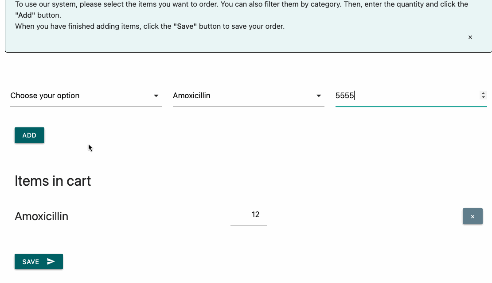
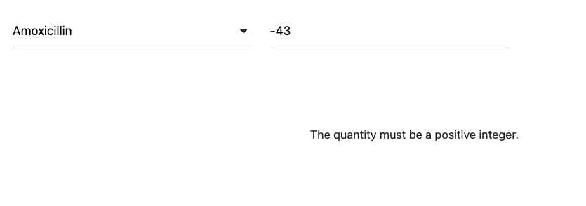
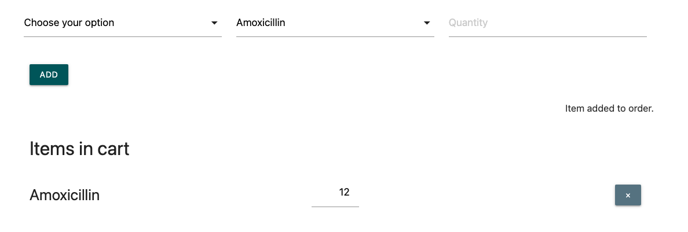
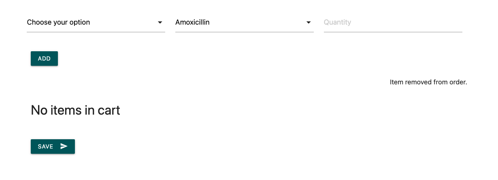
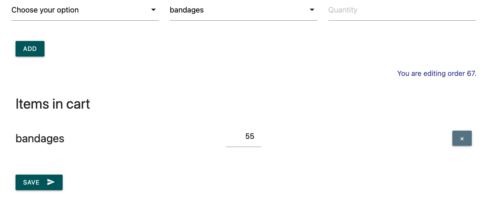
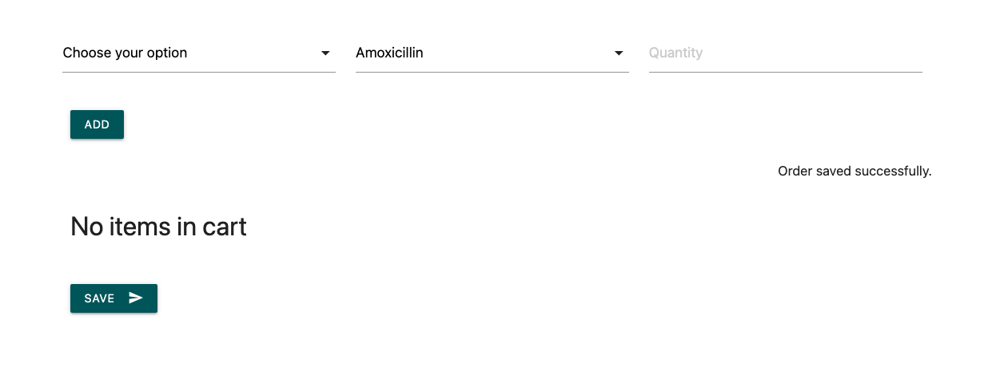
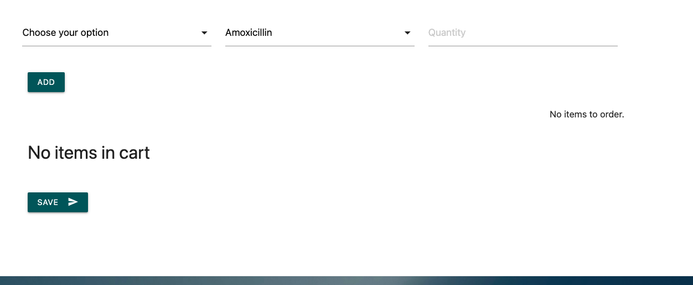
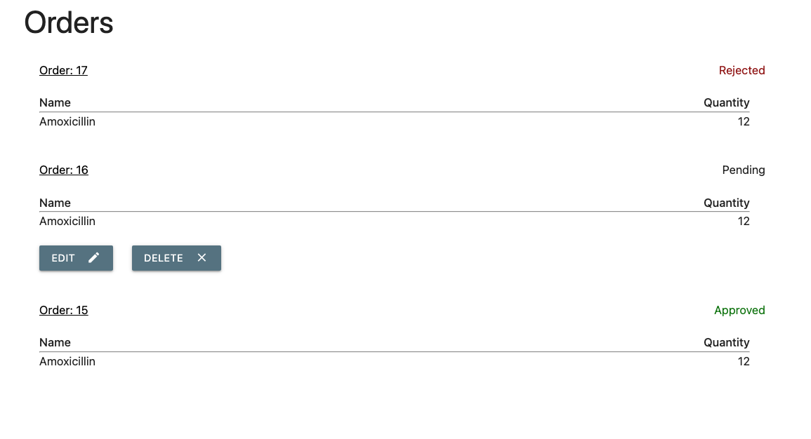
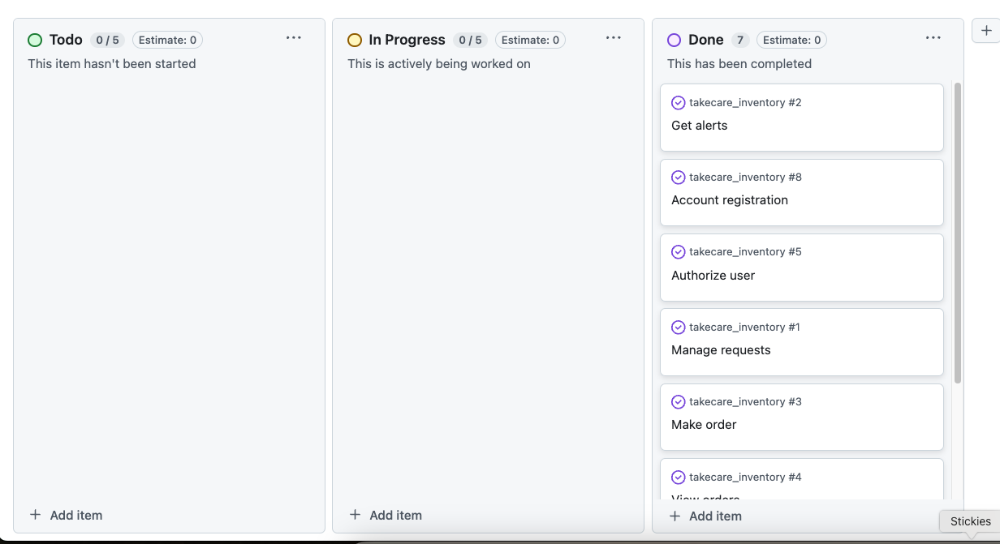

# TakeCare Inventory Management

[TakeCare Inventory Management](https://takecare-inventory-187635d57664.herokuapp.com/) is a web application designed for healthcare professionals to efficiently manage stock levels and request products. Users can easily filter items to find what they need and view their selected products in a cart on the same page, making order management more intuitive. For managers, the admin panel provides important alerts when items are low in stock, close to expiration, or when new users need approval, ensuring smooth inventory oversight.

- User Access
    - Users must log in to access the platform.
    - New users require approval; upon registration, a request is sent to the admin panel for manager approval.
- Ordering Process
    - Approved users can search for items, filter them by category, add them to an order list, and submit requests.
    - Orders require approval; while pending, users can modify them.
- Manager Role
    - Managers can approve or reject orders but cannot modify them.
    - They are responsible for updating item categories, stock quantities, expiration dates, and marking critical products.

## User Stories
+ As a first-time visitor, the user:
    + Is taken to the home page:
        + The landing page introduces the purpose and features of the app.
        + A brief overview explains the app's benefits and how it can be used effectively.
        + The user is provided with a clear call-to-action (CTA) to learn more about the app's functionalities, features, and its intended audience.
    + Can easily register to use the app:
        + A visible and user-friendly registration button allows the user to sign up easily.
        + The registration form requires essential details, such as name, email, and password, for account creation.

+ As a return visitor, the user:
    + Will be redirected to the home page for registered users (if approved by management):
        + Upon login, the user is directed to a homepage tailored for registered users.
        + The user can access all functionalities of the app.
        + Can easily see information on how to make requests.
        + Can filter items by selecting a category.
        + Can select items to order and specify the quantity.
        + A clear "Save" button is available, allowing the user to confirm their selections and send the order to the system.
        + The user can see a message that the order has been submitted successfully.
        + Can navigate to the orders tab to view past orders and statuses:
        + Each order displays key details, such as the status (pending, approved, rejected) and can be clicked to view items ordered.
        + If an order is still pending, the user can edit or delete it by clicking on "Edit" or "Delete" button below the items ordered.
    + If the user is registered but yet to be approved:
        + The user is presented with a message on the home page stating that their registration is still awaiting approval from management.

+ Manager and Admin users can:
    + Create new categories.
    + Define expiration date, stock quantity, and item criticality when registering items in the system.
    + The manager/admin can set the stock quantity available and whether an item is labeled as critical or non-critical (to indicate its importance for inventory management).
    + See alerts when an item’s stock is low or when the expiration date is near.
    + See warnings on admin home page if items are expired/expiring or low-in/out-of stock.
    + Can review and approve or reject new user registrations.
    + Can review and approve or reject orders submitted by users based on availability and criticality of items.
    + See notifications when there are new pending user or order approvals.

## UX Design
The application is designed for healthcare professionals, including nurses, doctors, and administrative/warehouse staff responsible for managing medical supplies. It is particularly useful for clinics, hospitals, and care facilities that need an efficient way to track stock levels, place orders, and ensure essential items are always available. Managers benefit from automated alerts for low stock and expiring products, reducing the risk of shortages. While the system is optimized for desktop use in clinical settings, its responsive design ensures that users can access it seamlessly from mobile devices when needed.

### Color and Design Choices
+ The color scheme of TakeCare Inventory Management is primarily composed of shades of blue and gray, carefully chosen to align with the healthcare industry’s aesthetic. Blue is often associated with trust, professionalism, and calmness. Gray complements this by adding a sense of neutrality and balance, ensuring the interface remains clean and easy to navigate without unnecessary distractions. Together, these colors create a professional and reassuring atmosphere for users managing critical inventory tasks.
+ The images used throughout the platform follow the same blue and gray tones to maintain visual consistency and reinforce the theme of reliability. However, the hero image on the general home page features touches of yellow and red to introduce a sense of energy and urgency. This contrast helps capture attention and conveys the importance of efficient inventory management, encouraging users to engage with the system proactively.
+ The favicon was selected to represent the target audience of the application. However, its dark design may not be ideal for users browsing in dark mode.

### Wireframe
+ The initial wireframes for this project were created using [Balsamiq](https://balsamiq.com/):
+ Changes were made throughout the project delevolpment to improve UX and make the navigation more intuitive.

    + Login page:

    

    + Main ordering page without ordering items:

    

    + Main ordering page with ordering items:

    

    + Past orders page:

    

    + Past pending order:

    

    + Past approved order:

    

## Features
### Home page
- If the user is unauthenticated:
    - They can login or register by clicking on the links in the navbar.

    

- If the user is authenticated and approved:
    - They can start requesting, view past order or logout by clicking on the links in the navbar.

    

- If the user is authenticated but not approved:
    - They will see a message confirming that they registered but are waiting for approval from management.

    

### Admin panel
- When an admin logs in, an alert message is displayed if there are expired or near-expiry items, low-stock items, or pending user approvals.

- When approving multiple orders at once, if stock is insufficient for all, older orders will be approved first, while newer ones will stay pending. An alert message will indicate which orders couldn't be fulfilled due to low stock.
- If the order was already processed, the status can not be modified again.

- Manager can not add items without expiration date and the expiration date must be in the future.
- When an order is approved, the items are subtracted from the stock.

### User page
- Approved users can filter items by category.
- Users cannot add a quantity greater than the available stock; a message will display the available amount.
- Users can edit item quantities in their session, up to the maximum available:
    - If the entered quantity exceeds stock, it is automatically adjusted to the maximum.
    - If the quantity is less than 1, the item is removed from the list.

- If the same item is added again via the form, the quantity updates. If the total exceeds available stock, the item is not added.
- When the order is submitted, the home page is cleaned and the user can start a new request. If they leave an unsent order, the items in the order won't be lost if the page is closed/reloaded.
- Feedback is present for all actions:
    - Adding an item to the order:
    
    - Deleting an item from the order:
    
    - Editing order:
    
    - Order sent to management:
    

- The user can not submit an empty order.

- In the orders page, the users can see their past orders, items ordered, and statuses and modify the order if it is still pending.

- Tooltips are available for the statuses:

- If deleting a pending order, a popup requesting confirmation is shown, if user clicks "yes", the order is deleted from the database, otherwise, the popup closes.

## Future improvements
+ Implement notifications for users when their orders are approved or rejected.
+ Add a search feature to quickly find items across categories.
+ Implement multi-language support for broader accessibility.
+ Add user roles with varying levels of access (e.g., supervisor, staff).
+ Enhance reporting capabilities for inventory analytics (e.g., stock trends).
+ Add real-time stock level updates when items are added to or removed from orders.

## Technologies
### Front-end
+ [HTML](https://developer.mozilla.org/en-US/docs/Web/HTML) structures the pages.
+ [CSS](https://developer.mozilla.org/en-US/docs/Web/CSS) defines the style and layout.
+ [Materialize](https://materializecss.com/) provides the overall styling framework.
+ [JavaScript](https://developer.mozilla.org/en-US/docs/Web/JavaScript) with [jQuery](https://jquery.com/) add interactivity to the pages.

### Backend
+ [Django](https://www.djangoproject.com/) connects the front-end and back-end.
+ [Django Allauth](https://docs.allauth.org/en/latest/) handles user authentication.
+ [PostgreSQL](https://www.postgresql.org/) (provided by Code Institute) stores data in production.
+ [SQLite](https://www.sqlite.org/) stores data in the development fase (when `DEBUG` is `True`).
+ [Python](https://www.python.org/) is the main language for the project.

### Deployment and Version Control
+ [Git](https://git-scm.com/) manages version control.
+ [GitHub](https://github.com/) hosts the project.
+ [Heroku](https://www.heroku.com/) handles deployment.
+ [Whitenoise](https://whitenoise.readthedocs.io/en/latest/) serves static files to Heroku.

## Database Design
- The Entity-Relationship Diagram for the project was created on [dbdiagram.io](https://dbdiagram.io/home) before starting the project and adjusted as small changes were made.

- At the end of the project, `pygraphviz` and `django-extensions` were used to create a complete ERD for this project.

## Agile Development Process
### GitHub Projects

+ GitHub Projects has been a valuable tool for managing the Agile development process of this project. By using customizable boards, I’ve been able to break down the work into smaller, manageable tasks, which helped me prioritize features, and improvements in an organized manner.

## Deployment
### First steps
+ To deploy both locally and to an external app, you must first: 
    + Clone the repository from GitHub page by running the command `git clone https://github.com/mariaciceri/takecare_inventory.git`;
    + Alternatively, download it as a ZIP file from `https://github.com/mariaciceri/takecare_inventory` and extract it to a chosen location in your computer;
    + To install the necessary libraries, run `pip install -r requirements.txt`
    + Run the command `python manage.py migrate` to create the tables in the database before using the program.
    + Create a `env.py` file and at the top `import os`.
    + In the env.py create three variables using `os.environ.setdefault()`:
        + `SECRET_KEY` - and give it a value equivalent to a strong password.
        + `DEVELOPMENT` - and give the value of `"True"`.
        + `DATABASE_URL` - and provide a link to a database of choice.
    + Save the project on your own GitHub account by using the command `git push`.
    + To be able to use the admin panel, run `python3 manage.py createsuperuser` and follow the instructions, then use the credentials to access the admin panel and add items and categories to the databases.

    + Make sure to follow these steps before continuing with one of the deployment methods below.

### Deployment to Heroku

+ Create a new Heroku app by clicking on "New" and then "Create new app" on their page;

+ In the Deploy tab, look for "Deployment method" and select GitHub;

+ Connect to your GitHub account if not done already and right below it, find your repository and connect to Heroku;

+ Give your app a unique name and set the region accordingly. Click create app.
+ In the Settings tab, set one Config Vars:
    + DATABASE_URL(key): -your own database of choice-(value)
    + SECRET_KEY (key): -choose an unique and strong password-(value)

+ In the Deploy tab, scroll down to Manual Deploy, confirm that you are deploying from "main" and click on "Deploy Branch";

+ Alternatively, enable "Enable Automatic Deploys";

+ It may take a couple of minutes to deploy, after completed, a "View" button will be available and it will take you to the deployed page.

### Run locally

+ On the terminal, navigate to the folder where the project is located in your computer and run `python3 manage.py runserver`

## Testing

+ Multiple tests were conducted to verify that the app functions correctly and is fully responsive. For a detailed overview of all tests, refer to [TESTING.md](TESTING.md) 

## Credits

+ Images were sourced from [Pexels](https://www.pexels.com/) and [Unsplash](https://unsplash.com/).
+ General styling was adapted from [Materialize](https://materializecss.com/).
+ The favicon was obtained from [Icons 8](https://icons8.com/icons).
+ [Stackoverflow](https://stackoverflow.com/) and the [Django documentation](https://docs.djangoproject.com/en/5.1/) provided guidance for implementing various functions and methods throughout the project.
+ [ChatGPT](https://chatgpt.com/) assisted in understanding error messages.
+ [Wikipedia](https://en.wikipedia.org/wiki/Instruments_used_in_general_medicine) was used as a reference for general medical equipment when populating the database.
+ [VSCode](https://code.visualstudio.com/) is the integrated development environment (IDE) used for the project.
+ Iuliia Konovaloca's [e-commerce GitHub repository](https://github.com/IuliiaKonovalova/e-commerce) provided guidance for structuring the README.md and TESTING.md files.